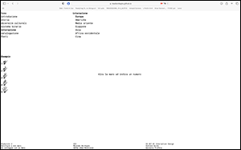
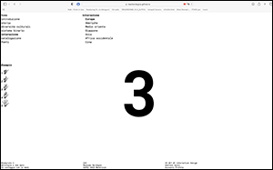

SUPSI 2022-23  
Corso d’interaction design, CV427.01  
Docenti: A. Gysin, G. Profeta  

Elaborato 2: Antologia a due mani  

# Conteggio con le mani
Autore: Massimo Bordogna  
[MediaPipe demo-ES6](https://ixd-supsi.github.io/2023/esempi/mp_hands/es6/1_landmarks)

Breve video dimostrativo<br>
LINK VIDEO

## Introduzione e tema
La consegna consisteva nell'effettuare una ricerca su un argomento dato legato al tema generale delle mani, nel mio caso si trattava
del "conteggio con le mani". Dopo aver fatto una ricerca generale per ottenere le informazioni 
di base, ho stilato la lista dei tre argomenti più importanti da trattare:
<br>
<b>storia<br>
diversità culturali<br>
sistema binario</b>
<br><br>
Ho quindi proseguito con l'approfondire i tre capitoli, in particolare svariati documenti trovati online 
di diverse ricerche universitarie mi hanno permesso di ottenere le informazioni necessarie.
<br><br>
Oltre alla ricerca è stata inserito un piccolo sistema interattivo che permette (a dipendenza della tipologia di 
conteggio selezionata) di riconoscere il numero che l'utente mostra alla webcam. 
<br><br>
Infine una catalogazione delle principali metodologie di conteggio con le mani racchiude le 
informazioni essenziali per comprenderle e metterle in pratica.

## Riferimenti progettuali
Non ho sfruttato un modello preciso come riferimento progettuale, ho riflettuto più che altro sui diversi contenuti 
da inserire e le loro esigenze di impaginazione e creazione.

L'aspetto più importante è stato quello di scegliere una modalità di presentazione che valorizzasse ed esaltasse 
il contenuto e la funzionalità degli argomenti trattati.


## Design dell’interfraccia e modalià di interazione
Tutte le scelte sono state effettuate per aumentare l'ergonomia del sito attraverso semplicità, chiarezza e coerenza. 
Tutte le pagine del sito web presentano la medesima impostazione: navigazione in alto a sinistra, footer in basso e contenuti nel centro sinistra della finestra.
Non è stato fatto uso del colore, lo sfondo è sempre bianco, il testo è sempre nero e le immagini sono in scala di grigi. 


Il bottone per tornare al sito web del corso è posto nella sezione con le informazioni del progetto "Antologia a due mani" nel footer in basso a sinistra.<br>


L'unica pagina all'interno del sito sviluppata in modo differente, è quella di interazione. Essa presenta 
una navigazione secondaria che permette di selezionare la tipologia di metodo di conteggio desiderato. L'interazione avviene attraverso la webcam che, 
riprendendo e trasmettendo quanto avviene di fronte al computer, permette all'utente di interagire direttamente con la piattaforma. 
Una legenda esemplificativa sul metodo di conteggio selezionato è posta sulla sinistra della pagina e gli elementi interattivi al centro. 
Dal momento che una mano viene riconosciuta, la scritta scompare e, se il gesto corretto è rappresentato attraverso la mano, il numero corrispondente compare al centro della schermata.

[]()[]()[]()[]()
<br>
<i>Schermate di: interazione base, interazione in corso, catalogazione, sistema binario </i>
<br>


## Tecnologia usata
L'intero sito è strutturato su un sistema di 10 colonne, le quali vengono sfruttate per l'organizzazione dei contenuti all'interno delle varie pagine.
Qui di seguito un esempio di suddivisione in colonne nel CSS:
```CSS
/*esempio suddivisione in colonne*/
display: grid;
grid-template-columns: 1fr 1fr 1fr 1fr 1fr 1fr 1fr 1fr 1fr 1fr;
```

L'interfaccia interattiva invece riconosce in numeri a dipendenza della distanza tra i vari punti della mano, di seguito un esempio:

```JavaScript
//----------------------------------------------
//Esempio codice riconoscimento dei numeri
if (hands.length == 1) {

			const manoA = hands[0]

			const indiceA  = manoA.keypoints[8]
			const polliceA = manoA.keypoints[4]
			const medioA = manoA.keypoints[12]
			const anulareA = manoA.keypoints[16]
			const mignoloA = manoA.keypoints[20]
			const palmoA = manoA.keypoints[0]
			const centroA = manoA.keypoints[5]
			const centroB = manoA.keypoints[13]

			const indicepalmo = dist(indiceA.x, indiceA.y, palmoA.x, palmoA.y)
			const pollicecentro = dist(polliceA.x, polliceA.y, centroA.x, centroA.y)
			const mediopalmo = dist(medioA.x, medioA.y, palmoA.x, palmoA.y)
			const anularepalmo = dist(anulareA.x, anulareA.y, palmoA.x, palmoA.y)
			const mignolopalmo = dist(mignoloA.x, mignoloA.y, palmoA.x, palmoA.y)
			const pollicecentroB = dist(polliceA.x, polliceA.y, centroB.x, centroB.y)

			if (pollicecentro>50 && indicepalmo>50 && mediopalmo>50 && anularepalmo>50 && mignolopalmo<100){
				background(255)
				image(img1, width/2-371/2/2, height/2- 586/2/2, 371/2, 586/2)
			}
			else if (pollicecentro>50 && indicepalmo>100 && mediopalmo>100 && anularepalmo<100 && mignolopalmo<100){
				background(255)
				image(img2, width/2-371/2/2, height/2- 586/2/2, 371/2, 586/2)
			}
			else if (pollicecentro>50 && indicepalmo>100 && mediopalmo<100 && anularepalmo<100 && mignolopalmo<100){
				background(255)
				image(img3, width/2-371/2/2, height/2- 586/2/2, 371/2, 586/2)
			}
			else if (pollicecentro>50 && indicepalmo<100 && mediopalmo<100 && anularepalmo<100 && mignolopalmo<100){
				background(255)
				image(img4, width/2-371/2/2, height/2- 586/2/2, 371/2, 586/2)
			}
			else if (pollicecentro<50 && indicepalmo<100 && mediopalmo<100 && anularepalmo<100 && mignolopalmo<100){
				background(255)
				image(img5, width/2-371/2/2, height/2- 586/2/2, 371/2, 586/2)
			}
			else if (pollicecentro>50 && indicepalmo>100 && mediopalmo>100 && anularepalmo>100 && mignolopalmo>100){
				background(255)
				image(img0, width/2-371/2/2, height/2- 586/2/2, 371/2, 586/2)
			}}
```

## Target e contesto d’uso
Non avendo costruito l’elaborato pensando in anticipo ad un target e ad un contesto specifico è 
difficile individuarne uno perfettamente calzante. Ovviamente andrebbe quindi adeguato al suo utilizzo 
finale, potrei però vedere la marionetta applicata ad un contesto espositivo quale magari una fiera 
o un’esposizione in cui i visitatori possono provare allo stand di riferimento la marionetta. 
Oppure potrebbe essere utilizzata all’interno di un sito web come interazione con l’utente stuzzicandone 
l’interesse e creando un legame di interazione attiva.

[]()
